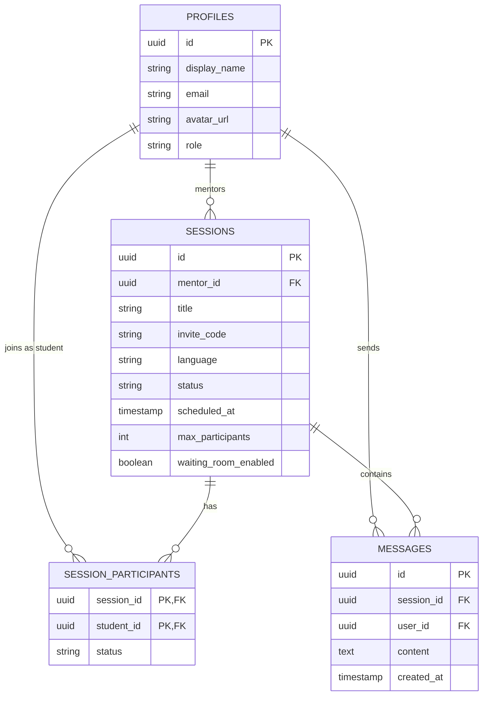

# 🚀 MentorSpace – Premium 1-on-1 Mentorship Platform

MentorSpace is a production-ready, high-end mentorship platform designed for seamless real-time interaction. It combines high-performance WebRTC video calling with collaborative coding and real-time communication to create an immersive learning environment.

---

## 🌐 Live Application

Access the platform using the links below. 

> [!IMPORTANT]
> **Order of Access:**
> 1. Click the **[Backend Link](https://mentorspace-5ifg.onrender.com/health)** first. Since it's hosted on Render's free tier, the server may need a few seconds to "wake up".
> 2. Once the backend shows a "status: ok" message, click the **[Frontend Link](https://mentorspace-vo68.vercel.app/)** to start using the software.

*   **Backend API**: [https://mentorspace-5ifg.onrender.com/](https://mentorspace-5ifg.onrender.com/)
*   **Frontend Application**: [https://mentorspace-vo68.vercel.app/](https://mentorspace-vo68.vercel.app/)

---

## ✨ Features & Capabilities

MentorSpace is packed with professional-grade features:

-   **🎭 Dual-Role System**: Specialized dashboards for both **Mentors** (session creation, participant management) and **Students** (joining via invite, session tracking).
-   **📹 Real-time Video/Audio**: High-quality 1-on-1 calls using WebRTC with mic/camera controls.
-   **💻 Collaborative Monaco Editor**: A full-featured code editor with syntax highlighting and real-time synchronization across all participants.
-   **💬 Live Chat Persistence**: Persistent messaging within sessions, allowing for resource sharing and discussion.
-   **🛡️ Secure Environment**: Robust authentication via Supabase/JWT and protective rate-limiting.
-   **🎨 Premium Glassmorphism UI**: A visually stunning interface built with Tailwind CSS and Framer Motion for smooth, cinematic transitions.

---

## 🏗️ Technical Architecture

The project follows a modern, scalable microservices-like architecture:

-   **Frontend**: Next.js 14 (App Router), TypeScript, Tailwind CSS, Framer Motion, Socket.io-client, simple-peer (WebRTC).
-   **Backend**: Node.js, Express, Socket.io, TypeScript, Supabase JS SDK.
-   **Database**: PostgreSQL (via Supabase).

### 📊 Entity Relationship (ER) Diagram



---

## 💻 Local Development Setup

Follow these steps to get MentorSpace running on your local machine:

### 1. Prerequisites
- Node.js (v18+)
- A Supabase account and project.
- Run the code in your Supabase SQL editor to set up the schema (use the tables defined in the ER diagram).

### 2. Backend Setup
```bash
# Navigate to backend directory
cd backend

# Install dependencies
npm install

# Configure environment variables
cp .env.example .env
# Fill in: SUPABASE_URL, SUPABASE_SERVICE_ROLE_KEY, SUPABASE_JWT_SECRET, DATABASE_URL

# Start development server
npm run dev
```

### 3. Frontend Setup
```bash
# Navigate to frontend directory
cd frontend

# Install dependencies
npm install

# Configure environment variables
cp .env.local.example .env.local
# Set: NEXT_PUBLIC_SUPABASE_URL, NEXT_PUBLIC_SUPABASE_ANON_KEY
# Set: NEXT_PUBLIC_BACKEND_URL=http://localhost:5000

# Start development server
npm run dev
```

---

## 🚀 Deployment Guide

### Frontend (Vercel)
1. Push code to GitHub.
2. Connect repository to Vercel.
3. Add all `NEXT_PUBLIC_*` environment variables.

### Backend (Render/Railway)
1. Deploy the `backend` folder.
2. Add necessary environment variables.
3. Ensure `FRONTEND_URL` in the backend `.env` matches your Vercel deployment URL for CORS.
